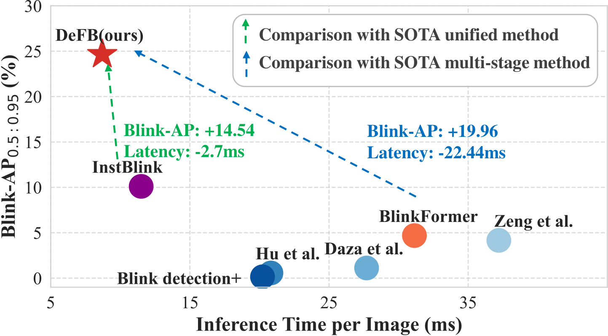
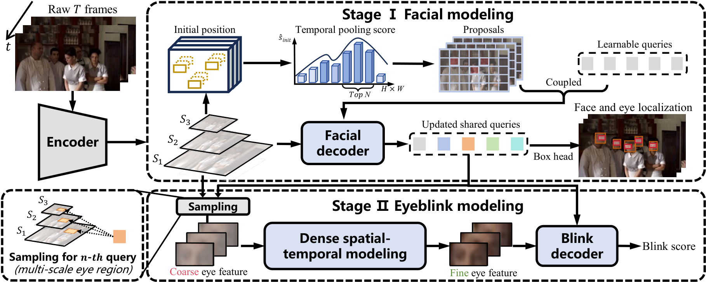

<p align="center">
  <h1 align="center">DeFB: Decomposed Feature Learning for Real-Time Multi-Person Eyeblink Detection in Untrimmed In-the-Wild Videos</h1>
  <p align="center">
    Jinfang Gan<sup>1</sup>,
    <a href="https://wenzhengzeng.github.io/">Wenzheng Zeng</a><sup>1,2*</sup>,
    <a href="https://scholar.google.com/citations?user=NeKBuXEAAAAJ">Yang Xiao</a><sup>1†</sup>,
    Xintao Zhang<sup>1</sup>,
    Chaoyang Zheng<sup>1</sup>,
    Ran Zhao<sup>1</sup>,
    <br>
    Ran Wang<sup>3,4</sup>,
    Min Du<sup>5</sup>,
    <a href="https://scholar.google.com/citations?user=396o2BAAAAAJ">Zhiguo Cao</a><sup>1</sup>
  </p>
  <p align="center">
    <sup>1</sup>Huazhong University of Science and Technology,
    <sup>2</sup>National University of Singapore,
    <br>
    <sup>3</sup>School of Journalism and Information Communication, HUST,
    <sup>4</sup>School of Future Technology, HUST,
    <sup>5</sup>ByteDance
  </p>
  <h3 align="center">AAAI 2026</h3>
  <h3 align="center">
    Paper (Coming Soon) |
    <a href="https://zenodo.org/record/7754768">Dataset</a> |
    <a href="#demo">Demo</a>
  </h3>
</p>

<p align="center">
    
</p>

<p align="center">
  <b>DeFB achieves a superior accuracy-efficiency balance compared to other SOTA methods.</b>
</p>

This repository contains the official implementation of the AAAI 2026 paper "DeFB: Decomposed Feature Learning for Real-Time Multi-Person Eyeblink Detection in Untrimmed In-the-Wild Videos".


## Highlights

- **Rethinking Unified Models:** We identify two critical limitations in existing unified multi-person eyeblink detection models: (1) feature granularity conflict between face localization and eyeblink detection, and (2) unstable face-eye feature learning during joint training.

- **Decomposed Feature Learning:** We propose DeFB, which models faces and eyes in granularity-specific feature spaces. This enables fine-grained spatio-temporal modeling for eyeblink detection while maintaining efficiency for face localization.

- **Asynchronous Training Strategy:** We adopt an asynchronous learning mechanism where eye feature learning refines well-trained coarse face features, significantly improving training stability and convergence.

- **State-of-the-Art Performance:** DeFB doubles the performance compared to previous SOTA (Blink-AP: 24.65% vs. 10.11%) while boosting efficiency by nearly 35%.

- **Plug-and-Play Capability:** DeFB can be integrated as a plug-in to substantially augment the eyeblink detection capabilities of general action detectors.

<p align="center">
    
</p>


## Installation

1. Create a new conda environment:

   ```bash
   conda create -n defb python=3.9
   conda activate defb
   ```

2. Install PyTorch (2.0.1+ is recommended):

   ```bash
   pip install torch>=2.0.1 torchvision>=0.15.2
   ```

3. Install other dependencies:

   ```bash
   pip install -r requirements.txt
   ```


## Data Preparation

### MPEblink Dataset

1. Download the [MPEblink dataset](https://doi.org/10.5281/zenodo.7754768) from Zenodo.

2. Organize the dataset as follows:
   ```
   data/
   └── mpeblink/
       ├── videos/
       │   ├── train/
       │   └── val/
       ├── annotations/
       │   ├── train.json
       │   └── val.json
       └── raw_frames/        # Generated in next step
   ```

3. Convert videos to raw frames:
   ```bash
   python tools/mpeblink_build_raw_frames_dataset.py --root $YOUR_DATA_PATH
   ```

4. Update the dataset path in `configs/dataset/mpeblink.yml`.


## Quick Start

### Demo Video

We provide a video introduction of our work:

https://github.com/user-attachments/fig/xxxxxx

### Full Training & Evaluation Pipeline

We provide a complete pipeline script `run_mpeblinkv1.sh` that includes all stages:

```bash
bash run_mpeblinkv1.sh
```

The pipeline consists of the following stages:

#### Stage 1: Facial Modeling Training

```bash
# First phase training (blink_len=10)
torchrun --nproc_per_node=2 tools/train.py \
    -c configs/rtdetrv2/rtdetrv2_r50vd_mpeblink_trainval.yml \
    --use-amp \
    --seed=0

# Second phase training (blink_len=30)
torchrun --nproc_per_node=2 tools/train.py \
    -c configs/rtdetrv2/rtdetrv2_r50vd_mpeblink_trainval_30.yml \
    --use-amp \
    --seed=0 \
    -r output/rtdetrv2_r50vd_mpeblink_trainval/checkpoint.pth
```

#### Stage 2: Inference on Training Set

```bash
# Inference on validation set
python test.py -c configs/rtdetrv2/rtdetrv2_r50vd_mpeblink_trainval_30.yml \
    -r output/rtdetrv2_r50vd_mpeblink_trainval_30/checkpoint.pth

# Inference on training set for blink module
python infer_trainset.py -c configs/rtdetrv2/rtdetrv2_r50vd_mpeblink_trainval_30.yml \
    -r output/rtdetrv2_r50vd_mpeblink_trainval_30/checkpoint.pth
```

#### Stage 3: Blink Module Training

```bash
# Split dataset for blink detection
python BlinkModel/split_dataset.py

# Train blink detection module
python BlinkModel/train_blink_detector.py \
    -c configs/BlinkModule/blink_module.yml
```

#### Stage 4: Evaluation

```bash
# Full model testing
python BlinkModel/test_eval.py \
    -c configs/BlinkModule/blink_module.yml \
    --track_result output/rtdetrv2_r50vd_mpeblink_trainval_30/val_results.json

# Convert results with threshold
python tools/instblink_plus_result_convertor_args.py \
    --input output/blink_results.json \
    --output output/final_results.json \
    --threshold 0.07

# Evaluate on MPEblink
python tools/eval_mpeblink.py \
    --pred output/final_results.json \
    --gt data/mpeblink/annotations/val.json
```


## Results

### MPEblink Dataset

| Type | Method | Blink-AP | Blink-AP<sub>0.5</sub> | Blink-AP<sub>0.75</sub> | Blink-AP<sub>0.95</sub> | Inst-AP |
|------|--------|----------|------------------------|-------------------------|-------------------------|---------|
| Multi-stage | BlinkFormer | 4.69 | 19.95 | 0.54 | 0.00 | 56.70 |
| Unified | InstBlink | 10.11 | 27.19 | 7.16 | 0.62 | 67.89 |
| **Unified** | **DeFB (Ours)** | **24.65** | **44.17** | **24.62** | **4.40** | **76.07** |

### Inference Speed

| Method | Time per image |
|--------|----------------|
| Multi-stage methods | T (=9.3ms) + latency × #faces |
| InstBlink | 8.9 + D (=2.6ms) |
| **DeFB (Ours)** | **6.1 + D (=2.6ms)** |


## Acknowledgement

This code is built upon [RT-DETRv2](https://github.com/lyuwenyu/RT-DETR) and [InstBlink](https://github.com/wenzhengzeng/MPEblink). We thank the authors for their excellent work.


## Citation

If you find our work useful in your research, please consider citing our paper:

```bibtex
@inproceedings{gan2026defb,
  title={DeFB: Decomposed Feature Learning for Real-Time Multi-Person Eyeblink Detection in Untrimmed In-the-Wild Videos},
  author={Gan, Jinfang and Zeng, Wenzheng and Xiao, Yang and Zhang, Xintao and Zheng, Chaoyang and Zhao, Ran and Wang, Ran and Du, Min and Cao, Zhiguo},
  booktitle={Proceedings of the AAAI Conference on Artificial Intelligence},
  year={2026}
}
```

If you use the MPEblink dataset, please also cite:

```bibtex
@inproceedings{zeng2023real,
  title={Real-time Multi-person Eyeblink Detection in the Wild for Untrimmed Video},
  author={Zeng, Wenzheng and Xiao, Yang and Wei, Sicheng and Gan, Jinfang and Zhang, Xintao and Cao, Zhiguo and Fang, Zhiwen and Zhou, Joey Tianyi},
  booktitle={Proceedings of the IEEE/CVF Conference on Computer Vision and Pattern Recognition (CVPR)},
  pages={13854--13863},
  year={2023}
}
```


## License

This project is released under the [Apache 2.0 license](LICENSE).


## Contact

For questions and suggestions, please open an issue or contact Jinfang Gan (jinfanggan@hust.edu.cn).

## Contact

For questions and suggestions, please open an issue or contact Jinfang Gan (jinfanggan@hust.edu.cn).
